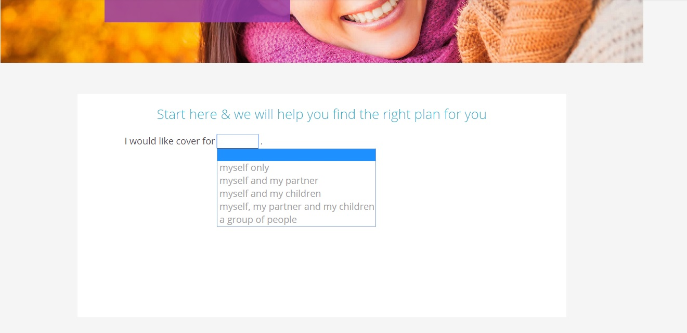
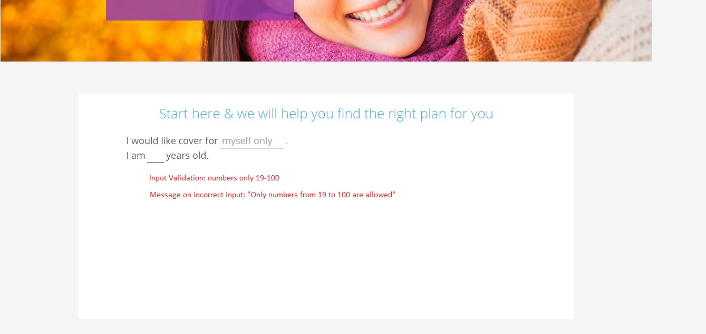

# QA Technical Task

A QA Technical interview based on an example with requirements and wireframes.

## Table Of Contents

* [Description](#description)
* [Wireframes](#wireframes)
* [Assumptions](#assumptions)
* [Requirements](#requirements)
* [Installation](#installation)

## Description

General description of the use case and application etc...

This repo contains tests and necessary files for the QA Technical Tester interview

In Order to apply for a health insurance
As A Online customer
I Want a facility to capture customer's Health Plan needs

Assumptions
1. Customer enters data in the online system, and each new field appears upon the completion of the previous. 

Requirement 1: Capture Who the health plan is for
1. Available options in drop down are:
  myself only
  myself and my partner
  myself and my children
  myself, my partner and my children
  a group of people
  
Requirement 2: Capture customer's age
1. Valid input is 19 to 100 years
2. Validation for characters and special symbols is done on input
3. If the input is incorrect, display error message "Only numbers from 19 to 100 are allowed"

Requirement 3: Capture preference for the type of care
1. Available options in drop down are:
  A basic level of cover
  Cardiac care*
  Day to day expenses cover
  Fertility care
  Maternity care
  Non-Cardiac procedure care**
  Ophthalmic care
  Orthopaedic care
  Psychiatric care
  
 
Requirement 4: Display number of available plans after age is put in
1. Display the block with Available Plans (example 78)

Requirement 5: Update number of available plans after level of cover is selected
1. Update the block with Available Plans (example 13)

Requirement 6: Allow to show all available plans
1. Present the customer with the "Show my plans button" after all input in complete

Second one: 

